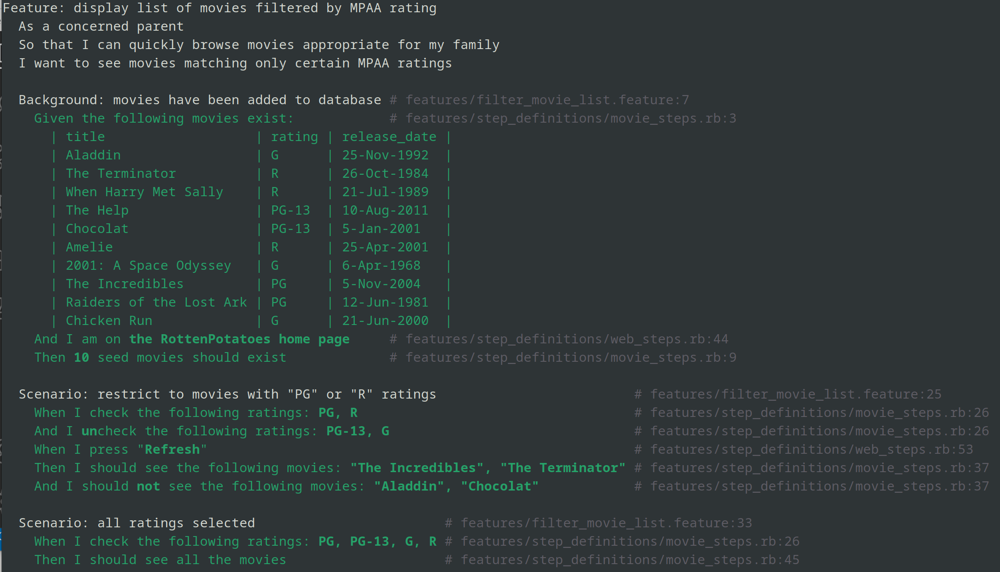
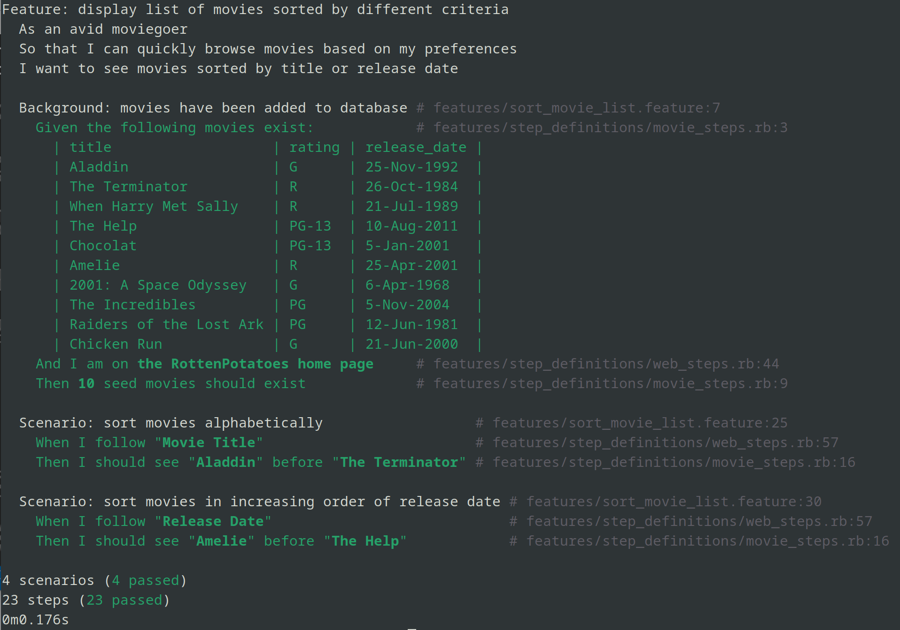

# Parte 1
**Pregunta 1**  
Para solucionar el problema de que un usuario pueda ingresar de manera manual un URI para mostrar una pelicula que no existe, editamos el método show del controlador para manejar la excepcion causada por el usuario, redirigiendolo a la vista principal con un mensaje de alerta.

```ruby
def show
    id = params[:id] # retrieve movie ID from URI route
    begin
      @movie = Movie.find(id)
    rescue
      flash[:notice] = "Couldnt find movie with id #{id}"
      redirect_to movies_path
    end
  end
```

Ahora, si un usuario intenta ingresar a `movies/9999` sin que una pelicula con id = 9999 exista, encontrará:


**Pregunta 2**  
```ruby
class SessionsController < ApplicationController
 	def create
    	@user = User.find_or_create_from_auth_hash(auth_hash)
    	self.current_user = @user
    	redirect_to '/'
    end
    
    protected
    def auth_hash
        request.env['omniauth.auth']
    end
end
```
La referencia a `request.env['omniauth.auth']` podria estar en su propio metodo progetido `auth_hash` para que solo otros metodos de la clase SessionsController puedan utilizarla, tambien podría ser para tener código más limpio con menos repeticiones.

**Pregunta 7**
```ruby
require 'f1'
describe F1 do
    describe "a new f1" do
        before :each do ; @f1 = F1.new ; end
            it "should be a pain in the butt" do
                @f1.should be_a_pain_in_the_butt
            end
            it "should be awesome" do
                @f1.should be_awesome
            end
            it "should not be nil" do
                @f1.should_not  be_nil
            end
            it "should not be the empty string" do
                @f1.should_not == ""
            end
        end
    end
end
```

La sentecia `should` es similar a `expect` solo que con sintaxis distinta. Para pasar las pruebas, cada instancia de F1 (se crea una nueva antes de cada prueba unitaria) debe ser no nula y no una cadena vacia (3era y 4ta prueba), así como los matchers personalizados `be_a_pain_in_the_butt` y `be_awesome` (1era y 2da prueba).

# Parte 2: Cucumber
**Feature #1: Filter Movie List**  
La estructura del primer escenario `restrict to movies with "PG" or "R" ratings` será la siguiente:
```
Scenario: restrict to movies with "PG" or "R" ratings
  When I check the following ratings: PG, R
  And I uncheck the following ratings: PG-13, G
  When I press "Refresh"
  Then I should see the following movies: "The Incredibles", "The Terminator"
  And I should not see the following movies: "Aladdin", "Chocolat"
```
Ya tenemos definidos los pasos "should (not) see [...]" y "check the [...] checkbox" en `web_steps.rb`. Entonces podemos definir nuevos pasos que tomen como argumentos varios parámetros a la vez y pase estos uno por uno a los pasos predefinidos. Lo realizamos de la siguiente manera:

```ruby
When /I (un)?check the following ratings: (.*)/ do |no, rating_list|
  rating_list.split(", ").each do |rat|
    steps %Q{
      When I #{no}check the "#{rat}" checkbox
    }
  end
end

Then /^I should (not )?see the following movies: (.*)$/ do |no, movie_list|
  movie_list.split(", ").each do |movie|
    steps %Q{
      Then I should #{no}see #{movie}
    }
  end
end
```

La estructura del escenario `all ratins selected` seria:
```
Scenario: all ratings selected
  When I check the following ratings: PG, PG-13, G, R
  Then I should see all the movies
```
De manera análoga al escenario anterior, podemos definir `should see all the movies` como una iteración de varios pasos `should see`. Lo realizamos de la siguiente manera:

```ruby
Then /I should see all the movies/ do
  Movie.all.each do |movie|
    expect(page.body.include? movie.title)
  end
end
```

**Feature #2: Sort Movie List**  
En este caso tendremos dos escenarios: ordenar por título y por fecha de estreno. A estos escenarios le damos la forma:

```
Scenario: sort movies alphabetically
  When I follow "Movie Title"
  Then I should see "Aladdin" before "The Terminator"


Scenario: sort movies in increasing order of release date
  When I follow "Release Date"
  Then I should see "Amelie" before "The Help"
```

El paso "I follow" ya esta predefinido, solo tendriamos que definir el paso "Should see [...] before [...]". Lo hacemos de la siguiente manera:

```ruby
Then /I should see "(.*)" before "(.*)"/ do |e1, e2|
  index_e1 = page.body.index(e1)
  index_e2 = page.body.index(e2)
  expect(index_e1 < index_e2)
end
```

Finalmente, verificamos que todas las pruebas pasan:




# Parte 3
